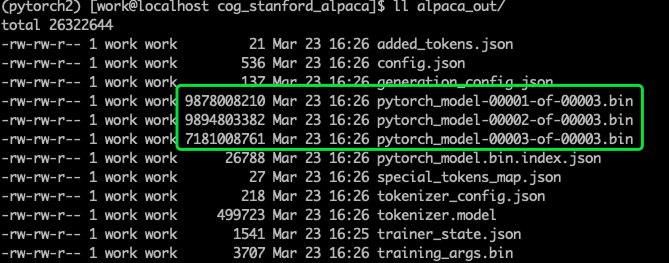
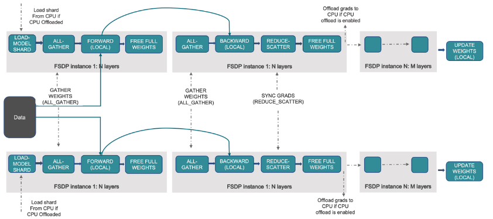

# LLM踩坑指北

LLM已经显现了其威力，然而目前OpenAI和google的大模型还是闭源，不利于学术界研究LLM的背后原理，因此Meta开源了LLaMA模型，以此为起点，不少组织开源了基于 LLaMA 的 Alpaca、Alpaca-Lora、Vicuna、ColossalAI等项目，大大降低了这类模型的研究、应用门槛，训练、推理成本一再降低。对于志于投身于LLM研究和应用的人来说，复现这些优秀的工作是第一步，本项目主要记录了复现过程中的踩坑经历，希望能够为大家的复现工作提供绵薄之力。


## Release

- V0.1 提供 LLaMA、Alpaca、Alpaca-Lora、ColossalChat的复现踩坑指北
- v0.2 TODO：
  - [Vicuna](https://github.com/lm-sys/FastChat)
  - [LMFlow](https://github.com/OptimalScale/LMFlow)
  - ColossalChat LoRa模式

## Contents

- LLaMA系列介绍
- GPU硬件环境
- Alpaca踩坑指北
- Alpaca-Lora踩坑指北
- Vicuna踩坑指北
- ColossalAI踩坑指北
- 附录


## 1. LLaMA系列介绍

ChatGPT算法的核心模块包括SFT、RM、RLHF三个，数据集目前仍未披露核心细节。当前的很多工作主要集中在复现SFT模块，包括LLaMA、Alpaca、Alpaca-Lora、Vicuna等，ColossalChat 目前复现了SFT+RM+RLHF整个流程。


Image source: https://openai.com/blog/chatgpt


### 1.1. 算法工作

- [LLaMA](https://github.com/facebookresearch/llama)。提供了一个pre-train的backbone。
- [Alpaca](https://github.com/tatsu-lab/stanford_alpaca)。SFT模块。基于self-instruct技术，做了指令微调 instruction fine-tune。
- [Alpaca-Lora](https://github.com/tloen/alpaca-lora)。SFT模块。利用LoRa技术，大大减少了需要微调的参数量。
- [Vicuna](https://github.com/lm-sys/FastChat)。SFT模块。
- [ColossalChat](https://github.com/hpcaitech/ColossalAI/tree/main/applications/Chat)。提供了SFT+RM+RLHF整个流程。

### 1.2. 数据集

- [AlpacaDataCleaned](https://github.com/gururise/AlpacaDataCleaned) 。对Alpaca提供的52k数据进行了进一步清理。
- [Alpaca-CoT](https://huggingface.co/datasets/QingyiSi/Alpaca-CoT)。加入了思维链chain-of-thought数据。
- [InstructionWild](https://github.com/XueFuzhao/InstructionWild)。colossalChat开放的数据集。
- [shareGPT](https://github.com/domeccleston/sharegpt)。一个 ChatGPT 数据共享网站，用户会上传自己觉得有趣的 ChatGPT 回答。

### 1.3. 有限资源下的部署

- [llama.cpp](https://github.com/ggerganov/llama.cpp)
- [alpaca.cpp](https://github.com/antimatter15/alpaca.cpp) 


## 2. 硬件和软件环境

### 2.1. 硬件环境

以下复现过程GPU主要基于NVIDIA Tesla A100 40G * 4 。部分场景会提供NVIDIA V100 32G * 4 的踩坑过程。

GPU和模型size的关系说明：

- 模型加载：要在GPU设备上加载模型，每个十亿个参数（1B模型）在float32精度中占用4GB GPU内存，在float16中占用2GB，在int8中占用1GB
- 优化器：如果使用AdamW优化器，每个参数需要8个字节（如果模型具有1B参数，则模型的完整AdamW优化器将需要8GB GPU内存）。

> [A Gentle Introduction to 8-bit Matrix Multiplication for transformers at scale using Hugging Face Transformers, Accelerate and bitsandbytes](https://huggingface.co/blog/hf-bitsandbytes-integration)


### 2.2. 软件环境

- [anaconda](https://www.anaconda.com/)
- python=3.8


## 3. Alpaca踩坑指北

### 3.1. 基础环境安装

- 安装pytorch2.0 

  ```Bash
  pip3 install numpy --pre torch --force-reinstall --index-url https://download.pytorch.org/whl/nightly/cu117
  # pip源加速
  # pip3 install numpy --pre torch --force-reinstall --index-url https://download.pytorch.org/whl/nightly/cu117 -i https://pypi.tuna.tsinghua.edu.cn/simple
  ```

- 测试pytorch gpu版本是否安装成功

  ```Python
  import torch
  print(torch.cuda.is_available())
  -------------
  True
  ```

- 安装最新版本的 transformer。version > 4.27.2，才有Llama系列的model

  ```Bash
  wget https://github.com/huggingface/transformers/archive/refs/heads/main.zip
  unzip main.zip
  pip install -e . -i https://pypi.tuna.tsinghua.edu.cn/simple
  ```

### 3.2. 训练

- 下载LLaMA初始模型[7B版本](https://huggingface.co/decapoda-research/llama-7b-hf)

- 部署Alpaca环境

  ```Bash
  wget https://github.com/replicate/cog_stanford_alpaca/archive/refs/heads/main.zip
  unzip main.zip
  pip install -r requirements.txt -i https://pypi.tuna.tsinghua.edu.cn/simple
  
  # 过程中可能会依赖的一些库
  conda install tensorboard
  conda install chardet
  ```

- 启动训练

  ```Bash
  sh -x train_model.sh
  
  tensorboard --logdir ./logs --bind_all # tensorboard 观察训练过程
  ```

### 3.3. 踩坑指北

#### 3.3.1 训练脚本

- V100不是Ampere架构，不支持bf16和tf32

  ```Bash
  ValueError: Your setup doesn't support bf16/gpu. You need torch>=1.10, using Ampere GPU with cuda>=11.0
  ```

- GPU memory OOM
- transformer版本对于LLaMA库的命名问题，LLaMADecoderLayer不是当前的名称
- 解决方案：修改 train_model.sh 脚本
  - 去除 --bf16
  - 去除 --tf32
  - 增加 -- fp16
  - --per_device_train_batch_size 调整为1
  - --per_device_eval_batch_size 调整为1
  - --gradient_accumulation_steps 调整为1
  - --fsdp_transformer_layer_cls_to_wrap调整为 LlamaDecoderLayer


#### 3.3.2 训练代码

- 模型保存失败，体现在无法从checkpoint通过from_pretrained()方法load模型，报错：


查看模型保存的output目录，发现3个`pytorch_model-*.bin`数据大小异常


仔细观察训练日志，会看到如下的提示**CUDA OOM during model saving**：


原因是GPU显存不够，导致save_model的时候，params无法copy到GPU:0上进行保存。

按照报错的提示，修改如下文件

`/home/work/anaconda3/envs/pytorch2/lib/python3.8/site-packages/torch/distributed/fsdp/_state_dict_utils.py`


再次训练，模型保存成功！



tensorboard 可视化训练过程：


### 3.4. 技术细节

#### 3.4.1 并行化训练

使用[pytorch提供（实现）](https://pytorch.org/docs/stable/fsdp.html)的[Fully Sharded Data Parallel (FSDP)](https://pytorch.org/blog/introducing-pytorch-fully-sharded-data-parallel-api/)技术（由Facebook借鉴Microsoft的Zero架构）。

> FSDP is a type of data-parallel training, but unlike traditional data-parallel, which maintains a per-GPU copy of a model’s parameters, gradients and optimizer states, it shards all of these states across data-parallel workers and can optionally offload the sharded model parameters to CPUs.



**sharding_strategy** 提供三种模式：

- FULL_SHARD。Parameters, gradients, and optimizer states are sharded
- SHARD_GRAD_OP。Gradients and optimizer states are sharded during computation, and additionally, parameters are sharded outside computation. 
- NO_SHARD。类似于DistributedDataParallel（DDP）

**cpu_offload。**To further maximize memory efficiency, FSDP can offload the parameters, gradients and optimizer states to CPUs when the instance is not active in the computation.


#### 3.4.2 huggingface的transformers提供的并行化训练能力

- [fsdp](https://huggingface.co/docs/transformers/v4.27.2/en/main_classes/trainer#transformers.TrainingArguments)(`bool`, `str` or list of `FSDPOption`, *optional*, defaults to `False`)—— Use PyTorch Distributed Parallel Training (in distributed training only).
  - `"full_shard"`: Shard parameters, gradients and optimizer states.
  - `"shard_grad_op"`: Shard optimizer states and gradients.
  - `"offload"`: Offload parameters and gradients to CPUs (only compatible with `"full_shard"` and `"shard_grad_op"`).
  - `"auto_wrap"`: Automatically recursively wrap layers with FSDP using `default_auto_wrap_policy`.

- [fsdp_config](https://huggingface.co/docs/transformers/v4.27.2/en/main_classes/trainer#transformers.TrainingArguments) (`str` or `dict`, *optional*) — Config to be used with fsdp (Pytorch Distributed Parallel Training). The value is either a location of deepspeed json config file (e.g., `ds_config.json`) or an already loaded json file as `dict`.


#### 3.4.3 单机多卡 vs 多机多卡

**单机多卡**。假设你有个 1台4卡A100 

```Bash
torchrun \
--nnodes 1 \
--nproc_per_node=4

……
```

**多机多卡**。假设你有2台A100，每台4卡

```Bash
torchrun \
--nnodes=2 \
--nproc_per_node=4

……
```


## 4. Alpaca-Lora踩坑指北

### 4.1 已有的7B和30B开源版本

#### 4.1.1 7B版本

https://huggingface.co/tloen/alpaca-lora-7b

[decapoda-research/llama-7b-hf · Hugging Face](https://huggingface.co/decapoda-research/llama-7b-hf)

#### 4.1.2 30B版本

https://huggingface.co/chansung/alpaca-lora-30b/tree/main

https://huggingface.co/decapoda-research/llama-30b-hf/tree/main


### 4.2 效果测试

#### 4.2.1 部署[alpaca-lora](https://github.com/tloen/alpaca-lora)

```Bash
wget https://github.com/tloen/alpaca-lora/archive/refs/heads/main.zip
unzip main.zip

pip install cudatoolkit # bitsandbytes 依赖cudatoolkit
pip install -r requirements.txt # 依赖bitsandbytes
pip install cchardet # -i https://pypi.tuna.tsinghua.edu.cn/simple
```

#### 4.2.2 修改generate.py

修改`generate.py`，如下所示


不然在inference阶段会报错：


#### 4.2.3 启动服务

```Bash
python generate.py \
    --load_8bit \
    --base_model '../llama-7b' \            # llama 模型地址
    --lora_weights '../alpaca-lora-7b'      # alpaca-lora 模型地址
```

结果如下：


#### 4.2.4 inference速度优化

1. 使用llama-lora模型进行推理，速度会比直接使用alpaca慢很多，大概是x10倍左右。
2. 加速方式：`merge the LoRA weights back into the base model for export to Hugging Face format`
3. 脚本：`export_hf_checkpoint.py`，修改base model和lora model地址


4. 执行命令，合并weight：

   ```undefined
   python export_hf_checkpoint.py
   ```

5. 会在目录下生成`hf_ckpt`文件夹：


6. 接着，按照加载llama模型的方式加载即可

   ```undefined
   model = LlamaForCausalLM.from_pretrained("./hf_ckpt/").to('cuda')
   ```

### 4.3 训练 [alpaca-lora](https://github.com/tloen/alpaca-lora)

#### 4.3.1 添加训练脚本，支持多GPUs

```Bash
# 4张A100 40G GPU
WORLD_SIZE=4 CUDA_VISIBLE_DEVICES=0,1,2,3 torchrun \
    --nproc_per_node=4 \
    --master_port=1234 \
    finetune.py \
    --base_model 'decapoda-research/llama-7b-hf' \
    --data_path './alpaca_data_cleaned.json' \
    --output_dir './lora-alpaca' \
    --batch_size 128 \
    --micro_batch_size 4 \
    --num_epochs 3 \
    --learning_rate 1e-4 \
    --cutoff_len 512 \
    --val_set_size 2000 \
    --lora_r 8 \
    --lora_alpha 16 \
    --lora_dropout 0.05 \
    --lora_target_modules '[q_proj,v_proj]' \
    --train_on_inputs \
    --group_by_length
```

#### 4.3.2 添加tensorboad支持（也可以使用wandb）


#### 4.3.3 训练过程


## 5. [TODO]Vicuna踩坑指北


## 6. ColossalAI踩坑指北

[ColossalAI](https://github.com/hpcaitech/ColossalAI) 提供了一套完整的类似ChatGPT训练的开源代码，[blog](https://mp.weixin.qq.com/s/V5pCvYvkPXwiMw-FNIErXw)说明。

### 6.1 环境安装

```Bash
# 重要！检查并升级gcc版本，CUDA 11.7要求gcc版本 >=6.0.0 & <=11.5.0
```

```Bash
# 安装ColossalAI
wget https://github.com/hpcaitech/ColossalAI/archive/refs/heads/main.zip
unzip main.zip
cd ColossalAI-main
```

```Bash
# [安装和pytorch版本对于的cuda](https://anaconda.org/nvidia/cuda)
# 我的CUDA版本是11.7
conda install -c "nvidia/label/cuda-11.7.0" cuda
```

```Bash
# build the PyTorch extensions during installation
CUDA_EXT=1 pip install .
```

```Bash
# 安装ColossalChat
cd applications/Chat/
pip install .
```

### 6.2 训练模型

```Bash
cd examples
```

#### 6.2.1 Stage1 - （SFT）Supervised instructs tuning

```Bash
torchrun --standalone --nproc_per_node=4 train_sft.py \
    --pretrain "/path/to/LLaMa-7B/" \
    --model 'llama' \
    --strategy colossalai_zero2 \
    --log_interval 10 \
    --save_path  /path/to/Coati-7B \
    --dataset /path/to/data.json \
    --batch_size 4 \
    --accimulation_steps 8 \
    --lr 2e-5 \
    --max_datasets_size 512 \
    --max_epochs 1 \
```

#### 6.2.2 Stage2 - （RM）Training reward model

```Bash
torchrun --standalone --nproc_per_node=4 train_reward_model.py
    --pretrain "/path/to/LLaMa-7B/" \
    --model 'llama' \
    --strategy colossalai_zero2 \
    --loss_fn 'log_exp'\
    --save_path 'rmstatic.pt' \
```

#### 6.2.3 Stage3 - （RLHF）Training model with reinforcement learning by human feedback

```Bash
torchrun --standalone --nproc_per_node=4 train_prompts.py \
         --pretrain "/path/to/LLaMa-7B/" \
         --model 'llama' \
         --strategy colossalai_zero2 \
         --prompt_path /path/to/your/prompt_dataset \
         --pretrain_dataset /path/to/your/pretrain_dataset \
         --rm_pretrain /your/pretrain/rm/defination \
         --rm_path /your/rm/model/path
```

### 6.3 inference

```Python
# 8-bit setup
# export LD_LIBRARY_PATH=$CUDA_HOME/lib64:$LD_LIBRARY_PATH
from transformers import LlamaForCausalLMUSE_8BIT = True # use 8-bit quantization; otherwise, use fp16
model = LlamaForCausalLM.from_pretrained(
            "pretrained/path",
            load_in_8bit=USE_8BIT,
            torch_dtype=torch.float16,
            device_map="auto",
        )
if not USE_8BIT:
    model.half()  # use fp16model.eval()
```


## 附录

- 联系方式，欢迎交流
  - Email: sunlylorn@qq.com 
  - WeChat: sunlylorn